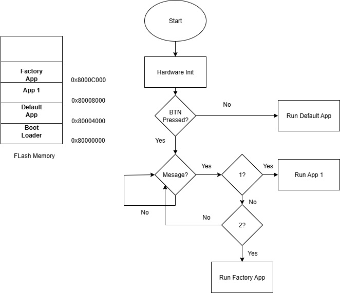

# STM32F411 Bare-Metal Firmware Project

## 📖 Overview

This project implements low-level (register-based) drivers for the STM32F411 microcontroller, developed using STM32CubeIDE. The main components include GPIO, UART, SPI, I2C, and a simple bootloader that can switch between multiple application images stored in flash memory.

All peripherals are configured directly via registers, without using HAL or LL drivers.

---

## 🧩 Features

- ⚙️ GPIO driver (input/output, LED control, button)
- 📡 UART driver (transmit/receive via USART2)
- 📦 SPI driver (master mode, 8-bit frame)
- 📗 I2C driver (standard mode & fast mode)
- 🔁 Bootloader:
  - Application validation
  - Jump to App1 / Factory App
  - Configurable base addresses

---

## 📁 Project Structure

---

## 🔧 Requirements

- STM32F411CEU6 board
- STM32CubeIDE >= v1.18.0
- USB-to-UART converter (for debugging)
- Serial terminal (Realterm)

---

## 📊 System Architecture

> Bootloader resides at `0x08000000`, jumps to:
> - Default App at `0x08004000`
> - App1 at `0x08008000`
> - Factory App at `0x08010000`

It verifies the memory region and vector table before jumping.

---

## 🛠️ How to Build & Flash

1. Open the project in **STM32CubeIDE**
2. Select and build `Bootloader` target → Flash to device
3. Build and flash `AppDeFault` / `App1` / `FactoryApp` to appropriate flash regions
4. Select App from CLI(Using Realterm to Simulation)
5. Observe UART logs 

---

## 🧪 Debugging Tips

- Use `printf()` redirected to UART for logs
- Check MSP value before jumping to app
- Make sure `__set_MSP()` and function pointer jump are correctly handled

---

## 📚 References

- [STM32F411 Reference Manual (RM0383)](https://www.st.com/resource/en/reference_manual/dm00119316.pdf)
- [STM32F411 Datasheet](https://www.st.com/resource/en/datasheet/stm32f411ce.pdf)
- [ARM Cortex-M4 Generic User Guide](https://developer.arm.com/documentation/dui0553/latest/)
- [Discovery kit with STM32F411VE MCU User Manual](https://www.st.com/resource/en/user_manual/um1842-discovery-kit-with-stm32f411ve-mcu-stmicroelectronics.pdf)

---

## 🚀 Future Enhancements

- OTA firmware update via UART or I2C
- Python tool to send app binary to bootloader
- CRC check before jumping to application

